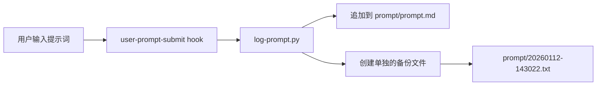

# Claude Code Hooks 使用指南

## 概述

本项目使用 Claude Code 的 Hooks 机制自动记录所有提示词和响应到规范格式的 Markdown 文件。

## 文件结构

```
.claude/
├── hooks/
│   ├── README.md           # 本文件
│   ├── log-prompt.py       # 记录用户提示词
│   └── log-response.py     # 记录 AI 响应
└── settings.local.json     # Hooks 配置
```

## 工作原理

### 1. 自动记录流程



### 2. 触发时机

**user-prompt-submit** hook 在以下时机触发：
- 用户发送新的提示词
- 使用 `/continue` 继续会话
- 使用 `/edit` 编辑文件后提交

### 3. 记录内容

每个提示词记录包含：
- **时间戳**: 精确到秒
- **会话ID**: 唯一标识符（基于时间戳）
- **模型信息**: 使用的 Claude 模型
- **工作目录**: 当前项目路径
- **上下文文件**: 本次提示词引用的文件列表
- **会话元数据**: JSON 格式的额外信息

## 配置

### settings.local.json

```json
{
  "permissions": {
    "allow": ["Bash(python:*)"]
  },
  "hooks": {
    "user-prompt-submit": "python .claude/hooks/log-prompt.py"
  }
}
```

### 环境变量

Hooks 可以访问以下环境变量：

| 变量名 | 说明 | 示例 |
|--------|------|------|
| `CLAUDE_USER_PROMPT` | 用户输入的提示词 | "帮我编写信号量代码" |
| `CLAUDE_CONTEXT_FILES` | 上下文文件 JSON | `[{"path":"src/kernel/sync/semaphore.c"}]` |
| `CLAUDE_MODEL` | 使用的模型 | "claude-sonnet-4.5" |
| `CLAUDE_WORKING_DIR` | 工作目录 | "D:\\AI\\homework\\AISafeOS64" |
| `CLAUDE_SESSION_TYPE` | 会话类型 | "new" 或 "resume" |

## 手动使用

### 记录现有提示词

如果手动记录提示词，可以使用提供的工具函数：

```python
from .claude.hooks.log_prompt import append_prompt_log

session_id = append_prompt_log(
    user_message="如何实现信号量？",
    context_files=[
        {"path": "src/kernel/sync/semaphore.c", "lines": "1-100"}
    ],
    session_info={
        "model": "claude-sonnet-4.5",
        "working_dir": "D:\\AI\\homework\\AISafeOS64",
        "session_type": "new"
    }
)
print(f"记录的会话ID: {session_id}")
```

### 批量导入历史提示词

使用提供的导入脚本：

```bash
# 导入单个历史文件
python .claude/hooks/import_history.py prompt/2026-01-08-64arm64.txt

# 导入所有历史文件
python .claude/hooks/import_history.py --all
```

## 输出格式

### prompt.md 格式

```markdown
---
## 提示词记录 #20260112-143022

**时间**: 2026-01-12 14:30:22
**会话类型**: new
**模型**: claude-sonnet-4.5
**工作目录**: `D:\AI\homework\ClaudeCode\AISafeOS64`

### 用户提示词

```
如何实现信号量？
```

### 上下文文件

- `src/kernel/sync/semaphore.c` (行: 1-357)
- `include/kernel/sync.h`

### 会话元数据

```json
{
  "session_id": "20260112-143022",
  "timestamp": "2026-01-12 14:30:22",
  "model": "claude-sonnet-4.5",
  "working_dir": "D:\\AI\\homework\\ClaudeCode\\AISafeOS64",
  "context_file_count": 2
}
```

---
```

## 扩展开发

### 添加新的 Hook

创建新的 hook 脚本：

```python
#!/usr/bin/env python3
# .claude/hooks/my_custom_hook.py

import os
import sys
from pathlib import Path

def main():
    # 读取环境变量
    user_prompt = os.getenv('CLAUDE_USER_PROMPT', '')

    # 自定义逻辑
    # ...

    return 0

if __name__ == '__main__':
    sys.exit(main())
```

在 `settings.local.json` 中注册：

```json
{
  "hooks": {
    "user-prompt-submit": "python .claude/hooks/log-prompt.py",
    "my-custom-event": "python .claude/hooks/my_custom_hook.py"
  }
}
```

### 可用的 Hook 事件

| 事件名 | 触发时机 | 用途 |
|--------|----------|------|
| `user-prompt-submit` | 用户提交提示词 | 记录提示词、验证输入 |
| `session-start` | 会话开始 | 初始化资源 |
| `session-end` | 会话结束 | 清理资源、生成报告 |
| `tool-before` | 工具调用前 | 验证参数、记录调用 |
| `tool-after` | 工具调用后 | 处理结果、错误检查 |

> 注意：Claude Code 的 Hook 系统仍在演进中，可用事件可能随版本变化。

## 故障排查

### Hook 未触发

1. 检查 `settings.local.json` 语法是否正确
2. 确认 Python 路径在系统 PATH 中
3. 手动运行 hook 脚本测试：

```bash
python .claude/hooks/log-prompt.py
```

### 权限错误

在 `settings.local.json` 中添加权限：

```json
{
  "permissions": {
    "allow": [
      "Bash(python:*)",
      "Bash(.claude/hooks/*)"
    ]
  }
}
```

### 记录不完整

检查日志输出：

```bash
# Windows
set CLAUDE_DEBUG=1
claude-code

# Linux/macOS
CLAUDE_DEBUG=1 claude-code
```

## 最佳实践

1. **定期备份**: 定期将 `prompt/` 目录提交到 Git
2. **敏感信息**: 避免在提示词中包含密码、API密钥等敏感信息
3. **文件命名**: 使用时间戳命名便于排序和搜索
4. **索引维护**: 定期在 `prompt.md` 顶部更新统计信息
5. **压缩归档**: 对于超过6个月的历史记录，考虑压缩归档

## 相关资源

- [Claude Code 官方文档](https://code.claude.com/docs)
- [Hooks API 参考](https://code.claude.com/docs/cli-reference/hooks)
- [Python 环境配置](https://code.claude.com/docs/advanced/python-env)

## 版本历史

- **v1.0** (2026-01-12): 初始版本
  - 实现 user-prompt-submit hook
  - 自动记录到 prompt.md
  - 单独备份文件生成
